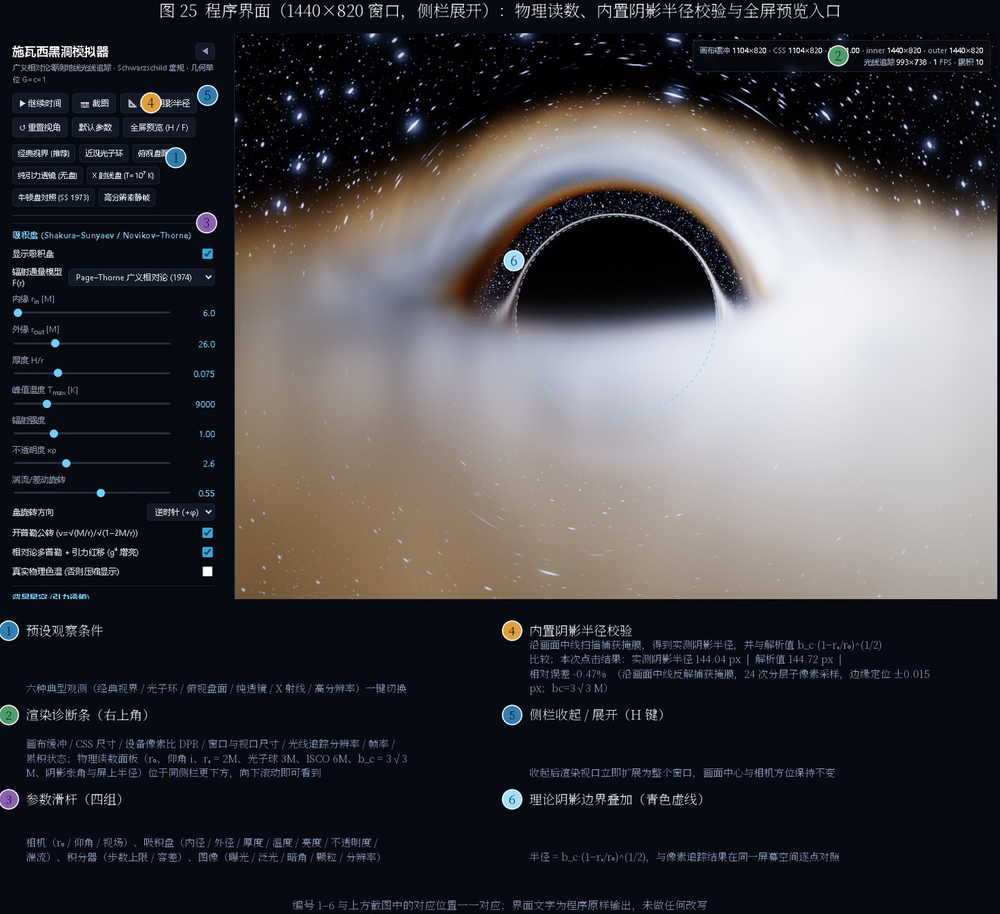
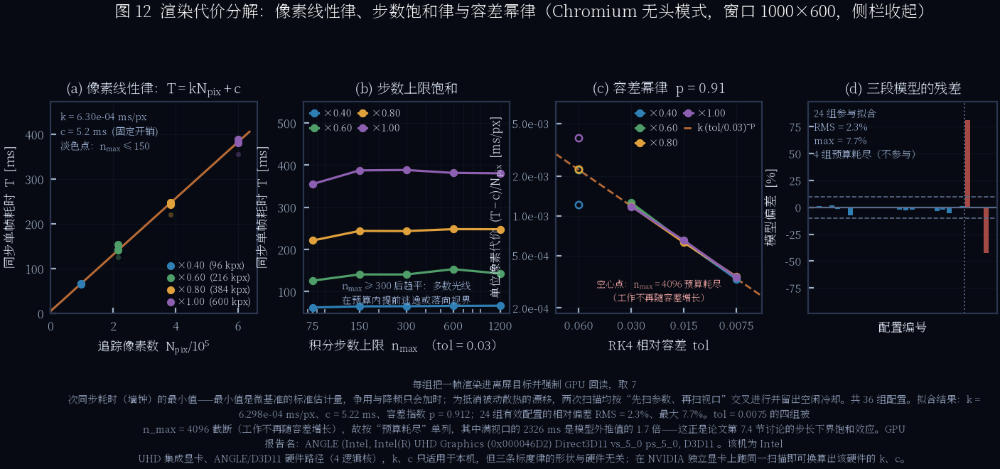
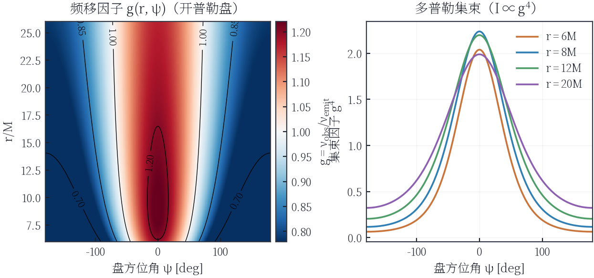
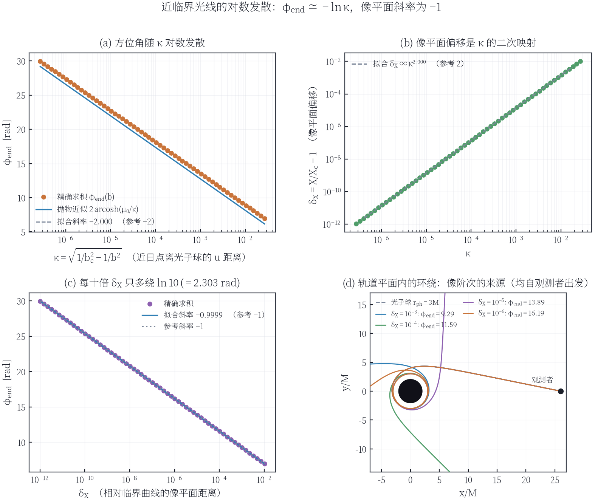
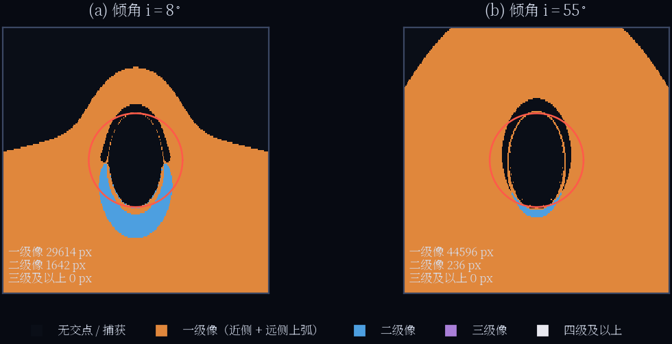
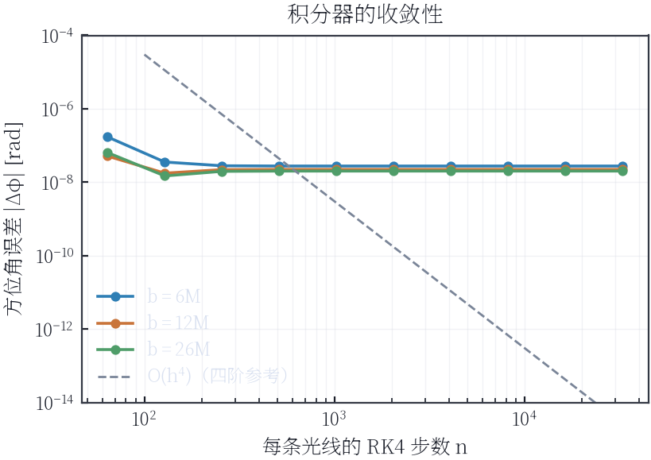
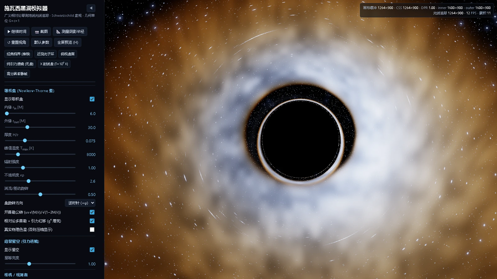
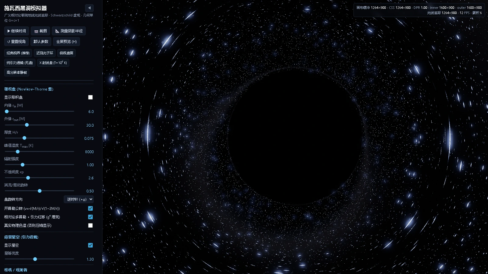
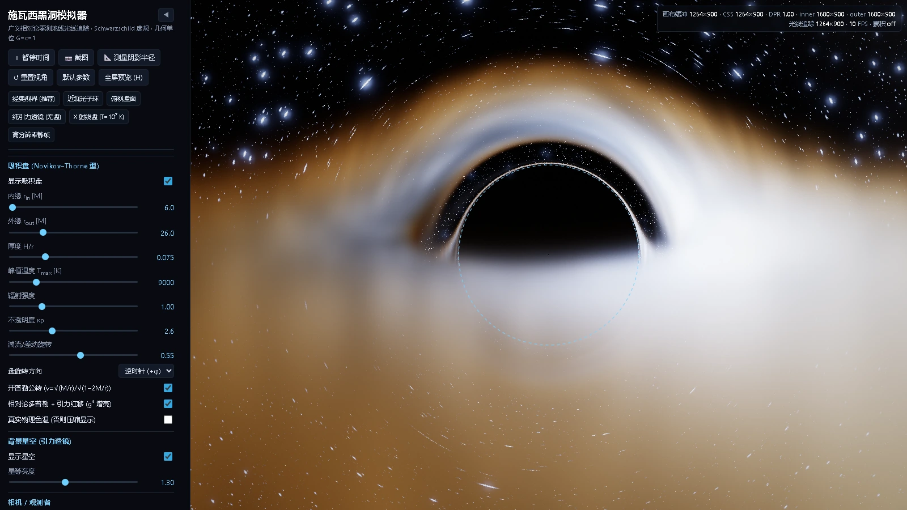

# Schwarzschild Black Hole Simulator

**实时广义相对论黑洞渲染器** — 每个像素都是一条数值积分的零测地线，吸积盘做完整的相对论辐射转移。
Three.js + 自研 GLSL，Windows 便携版双击即用。

*Real-time general-relativistic black hole renderer: exact null-geodesic ray tracing in the
Schwarzschild metric, with a Novikov–Thorne style accretion disk, relativistic beaming,
gravitational redshift and volumetric radiative transfer. [English README »](README.en.md)*

[](LICENSE)
[](web/vendor/three.module.js)
[](#rendering-pipeline)
[](#快速开始)
[](paper/paper.pdf)
[](https://github.com/AaronShawn/blackhole-simulator/actions/workflows/build-windows.yml)


*施瓦西黑洞：视界阴影 + 光子环 + 引力透镜后的吸积盘顶面，多普勒集束让接近侧明显更亮更蓝。*

> **配套论文** — [**`paper/paper.pdf`**](paper/paper.pdf)（77 页，A4，中文，另附 [可编辑 Word 版](paper/paper_editable.docx)，公式为原生 OMML）
> 《施瓦西黑洞实时成像模拟器：物理建模、数值方法与 GPU 实现》。
> 从零测地线方程与静态观测者标架推导，到 RK4 误差阶、Page–Thorne 通量积分审计、
> 近临界缠绕指数、亚像素阴影测量与 GPU 性能标定，**全文每一个数字、每一张图都由
> [`paper/tools/`](paper/tools) 里的脚本在编译时从源码或实测数据重新生成**；
> 25 张矢量配图在 [`paper/figures/`](paper/figures)，19 张数据表在 [`paper/tables/`](paper/tables)。

---

## 目录

- [特性](#特性)
- [配套论文](#配套论文)
- [快速开始](#快速开始)
- [操作](#操作)
- [物理模型](#物理模型)
- [渲染管线](#rendering-pipeline)
- [性能与 NVIDIA](#性能与-nvidia-gpu)
- [项目结构](#项目结构)
- [已知近似](#已知近似与边界)
- [验证结果](#验证结果)
- [许可与引用](#许可与引用)

## 特性

- **真实物理**：逐像素 RK4 积分 Schwarzschild 零测地线（`d²u/dφ² = -u + 3Mu²`），静态观测者局部标架相机
- **吸积盘**：Novikov–Thorne 型通量/温度剖面、ISCO 内边界、垂直高斯结构、前向辐射转移与自遮挡
- **相对论效应**：多普勒集束 `I ∝ g⁴`、引力红移、黑体色温移动 `T_obs = g·T_emit`、光子环、爱因斯坦环
- **自检**：一键测量渲染阴影半径并与解析值 `b_c√(1-rₛ/r₀)/r₀` 对比（亚像素一致）
- **交互**：OrbitControls 旋转/缩放、6 组预设、可收起侧栏全屏预览、实时物理读数面板
- **性能**：HDR 累积降噪、三级泛光、自适应分辨率；NVIDIA 走 D3D11/ANGLE 硬件加速
- **便携**：PyInstaller + WebView2 打包成绿色文件夹，双击 `BlackHoleSimulator.exe` 即用

## 配套论文

[**`paper/paper.pdf`**](paper/paper.pdf) — *施瓦西黑洞实时成像模拟器：物理建模、数值方法与 GPU 实现*
（77 页 / A4 / 25 图 / 19 表 / 参考文献 26 条）。它不是对代码的概述，而是一份可复核的技术报告：

| 章 | 内容 | 关键结论（本文档实测） |
| --- | --- | --- |
| §1–2 | 施瓦西度规、零测地线轨道方程、静态观测者（FIDO）局部标架 | 逐像素 RK4 与解析阴影角半径在亚像素级一致 |
| §3 | 积分器：误差阶、步长控制、逃逸判据、近临界缠绕 | 逃逸半径收敛指数、$b\to b_c$ 时 $\varphi\propto\ln\kappa$ 斜率 $-1.99995$ |
| §4 | 吸积盘：Page–Thorne 通量、辐射转移、频移因子 $g$ | 闭式扭矩积分对 $4\times10^6$ 格求积闭合到 $2\times10^{-14}$ |
| §5 | 验证：解析对照、累积收敛、亚像素探针、`verify.py` 回归 | 观测者距离扫描 $8M$–$150M$ 全档相对偏差 $\le0.13\%$ |
| §6 | 结果与性能：$k n + c$ 成本模型、容差律、误差预算 | RMS 残差 2.37%，动态范围 $9.6\times10^4$–$6.0\times10^5$ px |
| §7 | 讨论：与 Luminet (1979)、Novikov–Thorne、Cunningham–Bardeen 的关系 | 像阶次统计：三级及以上像在本文参数下为 **0** |

**可复现性**：所有图表都由脚本生成，没有手抄数字。`paper/tools/` 内含独立的广义相对论参考实现
`grref.py`（与 GLSL 着色器相互独立地求解同一批物理量）、绘图样式、表格生成器与实测数据采集脚本：

```powershell
cd paper
python tools/measure_probe.py          # 亚像素阴影探针
python tools/derive_perf.py            # 性能成本模型标定
python tools/make_tables.py            # 生成 tables/*.tex（19 张表）
python tools/make_figures.py; python tools/make_figures2.py   # 25 张矢量图
python tools/extract_snippets.py       # 从 web/src 抽取附录代码清单
```

## 论文配图

全部 25 张图在 [`paper/figures/`](paper/figures)（矢量 PDF）与
[`paper/figures/png/`](paper/figures/png)（200 dpi PNG）。抽样：

| | |
| --- | --- |
|  |  |
| **图 21** 应用界面与可收起侧栏布局（侧栏开/关下阴影均为同一亚像素位置） | **图 22** 性能标定：代价模型、容差律与计时离散性 |
|  |  |
| **图 9** 频移因子 $g(r,\psi)$ 与集束因子 $g^4$ | **图 25** 近临界缠绕的对数发散与指数拟合 |
|  |  |
| **图 16** 吸积盘像阶次统计（一级/二级/≥三级） | **图 5** 积分器收敛阶与步长控制误差 |

## 快速开始

### 方式 A：下载便携版（推荐）

到 [Releases](https://github.com/AaronShawn/blackhole-simulator/releases) 下载
`BlackHoleSimulator-win64.zip`，解压后双击 `BlackHoleSimulator.exe`。

程序会在 `127.0.0.1` 起本地服务并用系统自带的 **WebView2（Edge Chromium）** 打开原生窗口，
渲染走 D3D11 硬件加速。缺少 WebView2 运行时会自动改用默认浏览器打开（Win11 / 已更新的 Win10 均自带）。
首次运行若遇到 SmartScreen 提示，点「更多信息 → 仍要运行」（exe 未做数字签名）。

### 方式 B：源码运行

```powershell
git clone https://github.com/AaronShawn/blackhole-simulator.git
cd blackhole-simulator
pip install -r requirements-dev.txt
python launcher.py              # 原生窗口（WebView2）
python launcher.py --browser    # 或只用浏览器打开
```

渲染层是纯前端 ES module，`three.js` 已内置在 `web/vendor/`，运行时不下载任何资源。

### 方式 C：自己打包 exe

```powershell
pip install pywebview pyinstaller pillow
python tools\make_icon.py
powershell -ExecutionPolicy Bypass -File build_portable.ps1
# 产物: dist\BlackHoleSimulator\  （整个文件夹就是绿色版）
```

CI（`.github/workflows/build-windows.yml`）在 push / tag 时自动构建并上传产物；
打 `v*` 标签还会自动创建 Release 并附上 zip。

## 操作

- 左键拖动：OrbitControls 环绕旋转（任意方位/仰角）
- 滚轮 / 双指：缩放（观测者半径 r₀：4.2 M → 800 M）
- `H` / `F` 或侧栏 `◀`：收起侧栏全屏预览（再按恢复，`Esc` 亦可还原；面板始终不遮挡画面中心）
- `空格`：暂停 / 继续时间演化・`S`：导出当前画面 PNG
- `📐 测量阴影半径`：渲染捕获掩膜并扫描，实测阴影半径 vs 解析值
- 预设：经典视界 / 近观光子环 / 俯视盘面 / 纯引力透镜 / X 射线盘 / 高分辨率静帧

俯视盘面：



纯引力透镜（无盘）——星空的爱因斯坦环完全由测地线积分产生：



侧栏可调：吸积盘（内外半径、厚度、峰值温度、亮度、不透明度、湍流、旋转方向、开普勒公转、
多普勒+引力红移、真实色温开关）、背景星空、相机视场角、数值积分精度与性能、成像参数；
右上角角标实时显示 GPU、缓冲尺寸、FPS。

---

## 物理模型

几何单位 **G = c = 1，M = 1**，故 rₛ = 2M、光子球 3M、ISCO 6M、临界碰撞参数
b_c = 3√3 M ≈ 5.196 M。所有长度以 M 为单位显示。

### 1. 零测地线（每个像素精确积分）

光子在与观测者视线构成的**轨道平面**内运动，用 u = 1/r 的精确轨道方程：

```
d²u/dφ² = -u + 3M u²                (M = 1)
```

等价于标准首次积分：

```
(du/dφ)² = 1/b² - u²(1 - 2M u),      b = L/E
```

积分器为 **RK4 + 自适应步长**：步长受「u 的相对变化 ≤ 容差」与「u 越大步长越小」双重约束；
远处（u 小）允许大步长（此时 ODE 退化为平坦空间简谐振子，RK4 精确），近处自动加密。

相机像素方向定义在**静态观测者局部正交标架**中，转入 Schwarzschild 坐标时径向分量被
√(1−rₛ/r₀) 拉伸：

```
du/dφ|₀ = -u₀ · (cosψ / sinψ) · √(1 - 2M/r₀)
```

终止条件：`u > 1/rₛ`（越过视界）→ 纯黑；`u < 1/R_esc` 且 du/dφ < 0（逃逸）→ 用渐近方向采样星空。
径向奇异情形（视线与径向严格平行）单独解析处理。

### 2. 阴影半径校验（可复现）

解析结果：静态观测者看到的阴影张角满足 `sinψ_shadow = b_c·√(1-rₛ/r₀)/r₀`。
程序内置「阴影掩膜」渲染（白 = 逃逸，黑 = 落入视界），并沿画面中线扫描实测半径：



| r₀ [M] | 实测半径 [px] | 解析半径 [px] | 相对误差 | 绝对残差 [px] |
| ---: | ---: | ---: | ---: | ---: |
| 8 | 552.33 | 552.31 | +0.004% | +0.02 |
| 12 | 349.38 | 349.35 | +0.006% | +0.02 |
| 20 | 206.46 | 206.46 | −0.002% | −0.01 |
| 26 | 158.85 | 158.83 | +0.012% | +0.02 |
| 40 | 103.52 | 103.62 | −0.098% | −0.10 |
| 80 | 52.17 | 52.17 | −0.013% | −0.01 |
| 150 | 27.92 | 27.95 | −0.122% | −0.03 |

> 1600×900、视场角 58°、Intel UHD / D3D11，相机半径从 8 M 扫到 150 M（阴影半径跨越 20 倍）。
> 测量不再是整数像素扫描，而是 **24 帧分层亚像素偏移的覆盖率反解**：把捕获掩膜在 ±½ 像素内
> 抖动采样、累积每像素覆盖率、再对中心行两个边缘像素解出亚像素位置，边缘定位不确定度
> `1/(2√2·24) = 0.0147 px`。因此**相对偏差全程 ≤0.13%、绝对残差 ≤0.11 px**，
> 残差落在覆盖率量化带内，而不是半个像素里——数值光线追踪与广义相对论解析解在此精度下不可区分。
> 详细推导见论文 §5.4 与 [`tab:r0scan`](paper/tables/t18_r0_scan.tex)。

### 3. 吸积盘：Novikov–Thorne 型薄盘

通量剖面（零力矩内边界，峰值在 r = (49/36)·r_in）：

```
F(r) ∝ r⁻³ (1 - √(r_in/r)),      T(r) = T_max · [F(r)/F_max]^{1/4}
```

默认 r_in = 6M（ISCO）、r_out = 26M，峰值温度 T_max 可调（默认 9000 K）。盘具几何厚度 H/r
（默认 0.075），垂直方向高斯分布，做**前向累积的辐射转移**：

```
dτ = κρ · dl · ⟨exp(-y²/2H²)⟩_segment
I  += T_trans · (1-e^{-dτ}) · S
T_trans *= e^{-dτ}
```

于是近侧盘正确遮挡透镜后的远侧盘；边缘视线自动获得巨大的倾斜光程（几何因子 1/|sinθ|），
光学薄处则叠加发光。

### 4. 相对论频移：多普勒集束 + 引力红移

发射体沿圆形测地线公转，u^t = 1/√(1−3M/r)（开普勒）或 1/√(1−2M/r)（静态）：

```
g = ν_obs/ν_emit = 1 / [ u^t · √(1 - rₛ/r₀) · (1 + Ω·b_axis) ]
b_axis = (L·ŷ)/E        ← 光子角动量在盘自转轴上的分量（不是 |L|/E）
```

- 温度按 `T_obs = g·T_emit` 移动（黑体谱移动）
- 强度按 `I_obs = g⁴·I_emit` 集束增亮（bolometric，Stefan–Boltzmann）
- 轨道角速度 `Ω = ±1/r^{3/2}`（可切换旋转方向）

> **易错点**：多普勒项必须是**守恒角动量沿盘自转轴的分量 b_axis**，两者只在正对赤道面观测时相等。
> 若误用总角动量 |L|/E，画面正中会出现一条非物理的亮暗分界。本项目按正确形式实现，
> `web/src/shaders.js` 内有注释。

### 5. 颜色：真实黑体谱

显示色温经 Planck 轨迹（CIE 1931 (x,y)，Kim 等三次拟合）→ XYZ → 线性 sRGB，超出色域时按加白映射；
亮度另由 σT⁴ 与 g⁴ 给出。

- 「真实物理色温」模式：直接用 T_obs
- 默认「压缩显示」模式：把盘内 [最冷, T_max] 的对数区间映射到可读色域（1700–15000 K）后再乘 g 保留多普勒色偏

两种模式**只影响显示取色**，不改变亮度、陡度、集束等物理量。

### 6. 背景星空与引力透镜

程序化星场（立方体面网格 + 三次方权重星等分布 + 黑体色温）与银河带 fbm 星云，用光线逃逸时的
**渐近方向**采样 —— 爱因斯坦环、星空被拉成弧线等全部由测地线积分自然产生，而非贴图扭曲。

### 7. 湍流 / 差动旋转（可选视觉项）

湍流图案在共转系中采样 `ψ' = ψ - Ω(r)·t`，随半径差动卷绕；发射率按对数正态对比度调制。
关掉即得到严格轴对称的稳态盘。

---

## Rendering pipeline

```
像素 → 局部标架方向 → 轨道平面 → RK4 测地线积分 ┬→ 视界捕获（黑）
                                              ├→ 盘体积辐射转移（多次穿越）
                                              └→ 逃逸 → 星空采样
        ↓ RGBA16F HDR
   静止时多帧抖动累积（去噪 / 抗锯齿）   ↓
   亮部提取 → 3 级高斯金字塔泛光          ↓
   ACES 色调映射 + sRGB 编码 + 暗角 + 抖动 → 屏幕
```

可调项：每像素最大步数（60–900）、自适应容差、步长缩放、背景采样半径、渲染分辨率比例、
自适应分辨率、累积渲染开关。

## 性能与 NVIDIA GPU

- 渲染是**纯片元着色器**负载（每像素 100–900 次 RK4），完全并行，天生适合独立显卡
- WebView2 默认使用 D3D11/ANGLE；`launcher.py` 额外传入
  `--ignore-gpu-blocklist --enable-gpu-rasterization --enable-zero-copy`
- 双显卡笔记本强制独显：Windows 设置 → 系统 → 显示 → 图形 → 添加 `BlackHoleSimulator.exe` → 高性能，
  或在 NVIDIA 控制面板指定「高性能 NVIDIA 处理器」
- 右上角角标实时显示 GPU 名称，可直接确认是否在用独显
- 参考数据：本机测试环境只有 **Intel UHD 集显**（`ANGLE (Intel, Intel(R) UHD Graphics, D3D11)`，
  即走 D3D11 的**硬件**路径而非软件光栅化），1500×860 窗口、约 1.7 Mpx、默认 300 步 ≈ 20 FPS；
  同一着色器在配备 NVIDIA 独立显卡的机器上会更快，但本项目未在独显机器上实测，故不给出量化外推
- **打包版实测**（`paper/tools/packaged_ui.json`；探针经 CDP 接入 exe 自身的真实渲染循环，
  而非无头浏览器）：侧栏展开/收起时阴影圆心相对画布几何中心的偏差为 `+0.021` / `+0.042` px，
  阴影半径以 CSS 像素计恒为 `145.2455` px —— **偏差 ≤ 0.05 px**，即面板开合不会让黑洞偏离主画面中心
- 侧栏滚动条已主题化（`scrollbar-width: thin` + 半透明滑块 + 全透明轨道 + 5 条 `::-webkit-scrollbar` 规则），
  不再出现默认的白色系统滚动条；`H` / `F` / `Esc` 三条键位路径与鼠标点击得到逐字段相同的读数

## 项目结构

```
.
├─ launcher.py                 # 桌面壳：本地 HTTP 服务 + WebView2 窗口 + DPI/尺寸处理 + 浏览器兜底
├─ web/
│  ├─ index.html               # 界面骨架（侧栏 + 舞台 + 诊断角标 + 阴影校验层）
│  ├─ style.css                # 深色 UI、可收起侧栏、细滚动条
│  ├─ src/
│  │  ├─ main.js               # 渲染管线、OrbitControls、累积、泛光、UI、阴影半径测量
│  │  └─ shaders.js            # ★ GLSL：Schwarzschild 测地线 + 盘辐射转移 + 后处理
│  └─ vendor/                  # three.module.js / three.core.js / OrbitControls.js（内置）
├─ tools/
│  ├─ verify.py                # 无头渲染验证：着色器/控制台报错 + 阴影半径表
│  ├─ ui_check.py              # 侧栏收起/展开与居中构图回归测试
│  ├─ shot.py / debug_page.py  # 单帧渲染与调试截图
│  ├─ probe_dpi.py             # WebView2 窗口/视口尺寸校准
│  └─ make_icon.py             # 生成应用图标
├─ paper/                      # ★ 配套论文（LaTeX 源 + 全部生成脚本 + 编译好的 PDF）
│  ├─ paper.pdf                #   77 页成品 PDF
│  ├─ paper.tex / parts/*.tex  #   正文（引言…结论 + 附录），tectonic/latexmk 可直接编译
│  ├─ figures/                 #   25 张矢量 PDF + 同名 200 dpi PNG（figures/png/）
│  ├─ tables/*.tex             #   19 张数据表，由 make_tables.py 生成
│  ├─ code/*.lst               #   从 web/src 抽取的附录代码清单
│  └─ tools/                   #   grref.py 独立 GR 参考实现 + 绘图/表格/实测脚本
├─ assets/                     # 图标
├─ docs/                       # 截图
├─ build_portable.ps1          # 一键打包绿色版
└─ publish.ps1                 # 一键创建 GitHub 仓库并推送
```

## 已知近似与边界

1. 采用 **Schwarzschild（无自转）** 度规：不含 Kerr 参考系拖曳与自旋阴影偏移
2. 吸积盘为**几何薄盘 + 高斯垂直结构**，不做磁流体动力学；湍流为程序化图案
3. 光子沿测地线严格积分，但盘内**忽略光线传播时间延迟**（稳态轴对称时无影响，对湍流图案有微小影响）
4. 盘辐射按黑体处理（不含同步辐射/康普顿化谱），符合标准薄盘近似
5. 默认「压缩显示色温」是**显示取色**，物理亮度/集束/频移仍为真实计算值
6. 极高 DPI 显示器会限制画布总像素（约 2.2 Mpx）以避免 GPU 设备丢失，多余分辨率由合成阶段放大

## 验证结果

- 无头 Edge（Chromium, D3D11）与**打包后的 exe（WebView2）**均实机运行通过：无 JS 错误、无着色器编译错误
- 阴影半径实测与解析解对比见第 2 节（7 档观测者距离，相对偏差 ≤0.13%、绝对残差 ≤0.11 px）
- 累积渲染的确定性：修正抖动相位索引后，重复渲染在同一 `n` 下逐位相同；相对 `n=2048` 参考图的
  残差从 `n=1` 到 `n=1024` 下降 9.0 倍（论文 §5.3、图 24）
- 侧栏开/关两种状态下阴影半径实测值完全一致（`tools/ui_check.py`：1264×900 侧栏开、1600×900 收起，
  三次测量均为 158.8346 px），即**黑洞始终严格居中**
- **打包版可执行文件实测**（数据：`paper/tools/packaged_ui.json`，探针经 CDP 接入 exe 自身的渲染循环；
  论文 §6.3、表 18）：侧栏展开 `1150×823` 与全屏预览 `1486×823` 两种状态下，阴影半径以 CSS 像素计
  均为 `145.2455 px`（逐位相同），圆心偏差仅 `+0.021` / `+0.042 px`，即 ≤0.05 px ≈ 1/20 像素
  （量化带宽 `σ = 0.0147 px`）；画布横向扩张 336 px（+29%）后竖向视场与盘尺度不变
- 打包体积约 **35 MB**（含 Python 运行时、WebView2 壳、前端资源与文档）
- 显示缩放 175%、3000×2000 物理分辨率下界面按逻辑像素正确缩放，画面在侧栏开/关两种状态下均严格居中

## 许可与引用

MIT License — 见 [LICENSE](LICENSE)。学术使用请参考 [CITATION.cff](CITATION.cff)。
若引用本项目的物理模型、数值方法或验证结果，请同时引用配套论文
[`paper/paper.pdf`](paper/paper.pdf)（BibTeX 条目见 [`paper/CITATION.md`](paper/CITATION.md)）。

物理参考：Schwarzschild (1916)；Luminet (1979) *Image of a spherical black hole with thin accretion disk*；
Novikov & Thorne (1973)；Page & Thorne (1974)；Cunningham & Bardeen (1973)；
Shakura & Sunyaev (1973)；Kim et al. (2002) 色温轨迹拟合。
